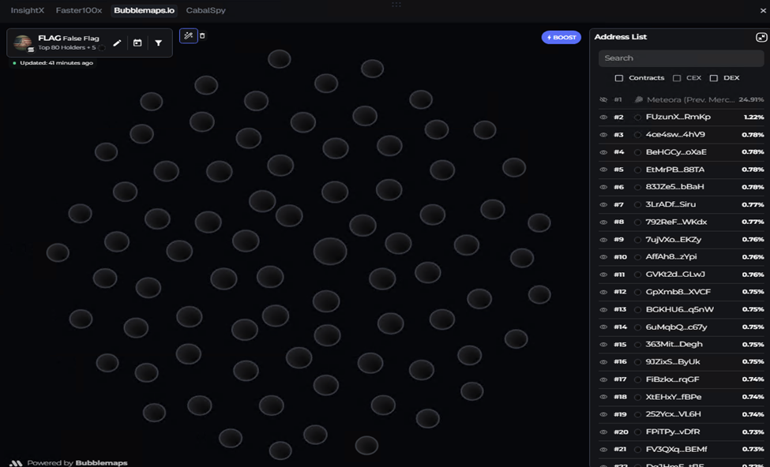

# Meteora-Alpha-Vault-Bundler

**Support:** [Pio-ne-er](https://t.me/hi_3333)

---

## Meteora token launch with Alpha Vault

### Overview

When you launch a token on Meteora, you can use **multiple wallets**—as many as you choose—to participate in the **initial distribution at one price** through an Alpha Vault. That lets you scale early quote in, widen holder count, and complete your planned allocation before unrelated traders can meaningfully react. The result is a more controlled opening: liquidity and holders look strong from day one, without parking the whole supply in a single “dev” wallet.

### Why teams use this pattern

- **Liquidity and optics** — Higher initial liquidity and a healthier starting market cap than a single-wallet buy often provide.
- **Holder breadth** — Tokens spread across several addresses you control, instead of one obvious creator wallet.
- **Sniping resistance** — The vault window and pool design narrow who can participate at the opening price, which reduces classic “snipe the pool” behavior from outsiders.
- **On-chain analytics** — Flows that do not look like a single coordinated Jito-style buy cluster can **read cleaner on tools such as Bubblemaps** (fewer obvious linked wallets), which matters to traders who screen launches.

### How it works (high level)

1. **Prepare wallets** — Fund the accounts you want in the vault ahead of time.
2. **Launch** — Open the pool with Alpha Vault support and the configured deposit / vesting rules.
3. **Participate** — Those wallets deposit and receive allocation **at the same effective price**, per vault rules—not staggered entries at different prices.
4. **Distribute** — Supply ends up across your planned wallets with the launch metrics you targeted.

This repository automates the Meteora-side setup (pool, mint, FCFS Alpha Vault) so you can operationalize that flow end to end.

### Compared with a Jito-style bundler

| Topic | Jito bundle (typical) | Alpha Vault on Meteora |
| --- | --- | --- |
| Wallet count | Often capped by bundle size / complexity | **No fixed “bundle size” cap** in the same sense; you scale via vault participants |
| Execution | Bundle landing can fail or reorder | **Simpler execution model** tied to vault + pool—no Jito tips |
| Bubblemaps / clustering | Multiple buys in one block can **link wallets visually** | **Cleaner separation** on analyzers when the narrative is vault-based participation, not one atomic swap bundle |

Exact on-chain fingerprints depend on how you operate wallets and fund them; Alpha Vault is built for **same-price, vault-scoped distribution** rather than a single multi-tx flash bundle.

### Summary

Alpha Vault on Meteora is a **controlled, efficient, and low-friction** way to bootstrap liquidity and holders at launch—while steering clear of common Jito bundle limits, tip costs, and the obvious “bundled buy” signature some scanners flag.

### Example: live token and Bubblemaps

**Token (Axiom):** [Flag on Solana](https://axiom.trade/meme/2piaCW5TP5prcR6Xyvm6W7f17biZ1p9zfGYQPEVrtJSS?chain=sol)

**Bubblemaps snapshot** — Top holders appear as **separate bubbles** without the transaction-link “spokes” that often appear when many wallets are funded and traded as one obvious cluster. LP (e.g. Meteora) typically shows as the largest holder; the rest trail in smaller, similar-sized slices—consistent with an intentional, non-single-wallet launch.

---

## What is Alpha Vault?

**Alpha Vault** is Meteora’s new **stealth bundling** method for token launches. It ties an Alpha Vault to a Meteora pool—supporting **DAMM** and **DAMM v2**—so liquidity is locked and early supporters (including dev wallets) can receive tokens at a single, fair price.

### Protocol mechanics

1. **Pool + Alpha Vault**  
   A Meteora pool (DAMM or DAMM v2) is created with Alpha Vault support (`CONNECT_ALPHA_VAULT_POOL=true`). The pool is linked to an Alpha Vault; liquidity in the pool can be locked.

2. **Early supporters**  
   Early supporter wallets (including multiple dev wallets) are connected to the same Alpha Vault. They are the only addresses that can participate in the initial distribution window.

3. **Same-price distribution**  
   The dev (or designated buyer) buys the token from the pool. Token supply is then distributed to supporter wallets **at the same price** as that buy—no front-running or different entry prices for insiders.

4. **Stealth bundling**  
   Because the flow uses a single vault linked to one pool with locked liquidity and a controlled participant set, it behaves like a “stealth” bundle: fair, same-price allocation to supporters without exposing the launch to arbitrary snipers or uneven pricing.

### In this repo

- Alpha Vault works with **DAMM** and **DAMM v2** pools. This bundler’s **DAMM v2 launch** creates a pool with `hasAlphaVault: true` and optional liquidity lock.
- **Alpha Vault (FCFS)** creates a First-Come-First-Served vault for that pool with configurable depositing window, vesting (start/end), caps, and whitelist mode (permissionless, merkle, or authority).
- Supporters deposit quote (e.g. WSOL/USDC) into the FCFS vault before the depositing deadline; tokens vest over the configured period.

---

## DAMM v2 Launch

1. Install dependencies:
   - `npm install`
2. Copy env template:
   - `cp .env.example .env`
3. Fill values in `.env`.
4. Run dry-run first:
   - `npm run launch:dammv2`

Script path: `src/damm-v2-launch.ts`
Output: `data/latest-pool.json`

## Token Mint

Use `npm run mint:token` to:
- create token mint (`SPL` or `Token-2022`)
- write output JSON (`data/latest-token-mint.json`)

## Alpha Vault (FCFS)

Use `npm run create:alpha-vault:fcfs` to:
- create FCFS (First-Come-First-Served) Alpha Vault for a DAMM or DAMM v2 pool
- use token mint from `TOKEN_MINT_OUTPUT_PATH`
- use pool address from `POOL_OUTPUT_PATH`
- write output JSON (`data/latest-alpha-vault.json`)

The FCFS vault defines a **depositing window** (quote only), **vesting** (start/end timestamps), **caps** (total and per-wallet), and **whitelist mode** (permissionless, merkle proof, or authority). Early supporters deposit quote into the vault; they receive the project token at the same price, with vesting applied.

---